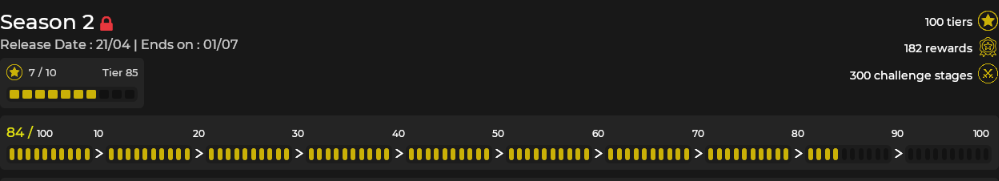

# Battle Pass
 
**Name :** Battle Pass

**Description :** Same as in Fortnite or other Battle Royale games, you'll be able to earn rewards & seasonal items through normal & premium tiers by defeating tons of challenges.

**Commands :** !bp / !pass / !battlepass

**Battle Pass menu :**

> **Challenges**

Basically, **Challenges** are missions, that you need to complete to get a new level of Battle Pass.

As it shown, there're different types of **Challenges**, their progress and the reward of completing one of missions, which we will call "Stars".

So, how does this Stars work? Simple. When you are finishing one of the **Challenges** you are getting a certain amount of Stars. Every 10 Stars you will level up and get new tier with a reward.

Also, when you are completing a mission, it does **NOT** end, on the contrary, it becomes harder and the rewards gets bigger.
So, you can say **"The more Challenge is harder, the more Stars you will get".**

> **Tiers**

If you have read the Challenges thread you already know, that to unlock a **tier** you have to get 10 Stars.
In this thread you will know more details about **tiers.**

As you might seen, there are **100 tiers** for eachSeason of Battle Pass. Getting each or several levels will unlock you a reward. Barely? Yes.

To find out which **tier** is locked and which unlocked, just look at the red padlock at the top right of tier . If there's none, then it is opened for you already. (Come and get your reward, sailor)

**If you see this:**

That means the reward is not taken by you. Otherwise, if you already have got a new **tier** and the "unlock" word is not written, that means you have taken this reward already:

   
> **Free & Premium parts**

As you already know, there are two sections that gives rewards in our Battle pass : the **Free** part and the **Premium** part.

To put it simple, those two parts have the same amount of tiers but **not the same rewards.**

Indeed, **Free part is available for everyone,** however the **Premium part is only available under some conditions that we're gonna explain bellow.**

Note that if you own the **Premium part,** you'll be able to unlock tiers of both parts which is not the case when you only have access to **Free part.**

**Free part :**

- available for all players without any **pre-requisites / conditions**
- same amount of tiers than **Premium part**
- less rewards than **Premium part**
- two seasonal skins unlockable at tier **50 & tier 100**

**Premium part :**

- available if you are a **Sponsor** or if you **bought a Battle Pass package**
- same amount of tiers than **Free part**
- more & unique rewards rather than in **Free part**
- four extra seasonal skins unlockable at **tier 1, tier 25, tier 50 & tier 100**

**How do I know if I have Premium part :**

But how could you know if you already have access to the **Premium part ?**

**Here are some factors :**

the red locker near the **Battle pass** title shouldn't be here -> 

you can unlock tiers of **Premium part**

you can buy tiers using the **Buy Tiers button**