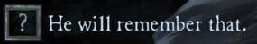

# Cases

**Name :** VoidCases.

**Desciption :** The name speaks for itself. You can buy cases in Cases Menu, open them with keys and get stuff like points, skins and even BP tiers. 

**Key :** Press B to open.

> **Shop**

To open **cases**, first you need to buy them. You can do it in the **Shop** tab (left side of the menu).

Some of the cases, like Hyperdimension Neptunia, **need a Key to be opened** (they are located at the bottom of the shop). You can know it by looking at the top right of a case. And if you see that symbol, it means that **you need a key** to open case -> 

There are **2 kinds of keys,** Normal and Premium. The **only difference** between them is the currency for which you can buy them.

But other cases **don't need keys** to be opened. These are Normal Cases.

**You can only** get points, premium points and BP tiers from them.

The last kind of cases **Custom cases.** You need a Special Key to open them, which you can get from Free Case. There's only two Custom case **- Astrea's Selection -** and **- dotCore's Selection -** at the moment, but we plan to do more (prepare your **millions of points** for dotCore's Selection case).

> **Market**

**Market** is a place, where every player can sell their stuff, from keys to collector skins they didn't want.

You can **easily** sell something too!

Just press the **"+ Sell Item"** button at the top right corner.

> **Trading**

Very convenient **trading system** allows you to **exchange stuff** with other people on the server!

*(As always, the Trading tab is located at the left side of the menu)*

If you're wondering "How can i swap some stuff with somebody?"

Then the answer is pretty simple - just **choose the person** you want to exchange with, wait until **he will accept** your Trade, then choose stuff you want to exchange (if you have some difficulties with a person, **you can always use Trade Chat** at the top right corner), confirm the trade and, of course, wait for your partner!

And if someone **offers you a trade,** press tab, F4, F2 or even enter the chat, so the cursor will appear, and accept it! Or cancel, that's **only your choice** (you insulted the person -> 

**Here you can see all drop rates for every quality of skins:**

Collectors

Exotic

Legendary

Mythic

Rare

Unusual

Common

